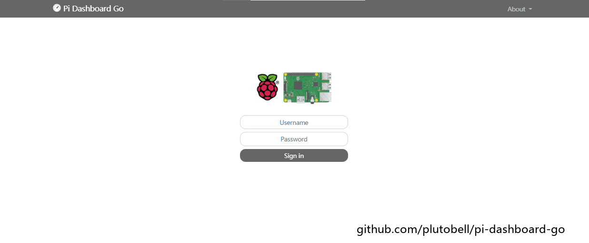

# Pi Dashboard Go
**Pi Dashboard Go** is a Golang implementation of pi-dashboard

* **[中文文档](https://ojoll.com/archives/86/)**





## Install

Thanks to the characteristics of the **[Golang](https://golang.org/)** language, the deployment of **Pi Dashboard Go** is very simple: **single binary executable file**.

#### Download

Just download the executable file from the project **[Releases](https://github.com/plutobell/pi-dashboard-go/releases)** page, **no other dependencies**.

#### Authority

Grant executable permissions

```
chmod +x pi-dashboard-go
```

**Note：Pi Dashboard Go requires root privileges.**


## Use

#### Usage

**Pi Dashboard Go** can be configured via command line parameters：

```bash
Pi Dashboard Go version: v1.7.0
Project address: https://github.com/plutobell/pi-dashboard-go

Usage: Pi Dashboard Go [-auth USR:PSW] [-disk Paths] [-help]
[-interval Seconds] [-log] [-net NIC] [-port Port]
[-session Days] [-theme Theme] [-title Title] [-version]

Options:
  -auth string
        specify username and password (default "pi:123")
  -disk string
        specify the filesystem path (default "/")
  -help
        this help
  -interval string
        specify the update interval in seconds (default "1")
  -log
        enable log display
  -net string
        specify the network device (default "lo")
  -port string
        specify the running port (default "8080")
  -session string
        specify the login status validity in days (default "7")
  -theme string
        specify the theme between 'light' and 'dark' (default "light")
  -title string
        specify the website title (default "Pi Dashboard Go")
  -version
        show version and exit
```


## Thanks

* **[Pi Dashboard](https://github.com/spoonysonny/pi-dashboard)**
* **[echo](https://github.com/labstack/echo)**
* **[gopsutil](https://github.com/shirou/gopsutil)**

* **[bootstrap](https://github.com/twbs/bootstrap)**
* **[jquery](https://github.com/jquery/jquery)**
* **[highcharts](https://github.com/highcharts/highcharts)**

## Changelog

* **[Changelog](./CHANGELOG.md)**